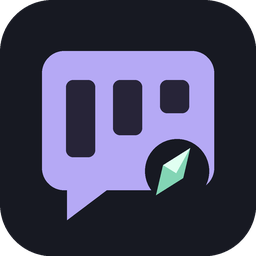
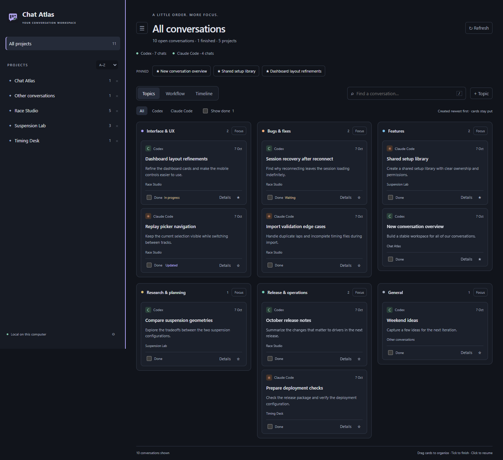

# Chat Atlas



A local VS Code extension that gives Codex and Claude Code conversations a stable home. Topics stay visible, cards keep their position when messages arrive, and a Done checkbox separates finished tasks from active work.

## Start

Download **chat-atlas-0.1.5.vsix** from the [latest release](https://github.com/dloppini/chat-atlas/releases/latest). In VS Code, open **Extensions**, choose **… → Install from VSIX…**, and select the downloaded file. Or run this command from your download folder:

```powershell
code --install-extension ./chat-atlas-0.1.5.vsix
```

Run **Chat Atlas: Open Board** from the Command Palette, or press **Ctrl+Alt+A** (macOS: **Cmd+Alt+A**). After first activation, **Chat Atlas** is also available in the status bar. Keep the board in the editor while working in the provider sidebar.

The LPX package uses extension ID `LPX.chat-atlas`. Earlier local previews used `local-tools.chat-atlas`, a separate extension identity with separate organization metadata. When switching, disable the old preview to avoid duplicate commands. Existing transcripts are unaffected.



Requires VS Code 1.96 or newer and local conversation history from Codex or Claude Code. An installed provider extension or CLI is needed to resume chats. Chat Atlas is an independent community project, unaffiliated with OpenAI or Anthropic.

## Use the board

- **Topics** automatically groups new conversations using local keyword rules against titles and the first prompt. Initial topics cover interface, fixes, features, research, releases, and general work. Use **+ Topic** to define a subject and its matching keywords. This is deterministic grouping, not an AI semantic classifier.
- **Workflow** groups the same cards into Inbox, In progress, Waiting, and Done. Progress is set by you; it does not pretend to know whether an agent is running or waiting for approval.
- Columns use taller scrolling lists. Click **Focus** in any column header to show only that group with more room for its conversations. Click **Exit focus** or press **Escape** to return to the board; each view retains its scroll positions. Focus survives refreshes and reopening the board, and switching between Topics, Workflow, and Timeline returns to the overview.
- **Timeline** shows creation dates, newest first. All views order cards by creation time so new messages do not reshuffle them. New conversations enter at their chronological position.
- Tick **Done** on any card. It is saved locally and hidden from the active board. Enable **Show done** to see finished cards, then untick to reopen one. This never archives or deletes the original conversation.
- Click a card title to resume it. Use **Details** for excerpts, editable board titles, topic/progress selectors, and a handoff note. These selectors also provide a keyboard alternative to drag and drop.
- Drag cards between topics or workflow columns. Manual topic choices are retained. Existing cards are not automatically reclassified after a new topic is created.
- Pin important chats with the star. Their shortcuts remain visible above the board.
- Use the sidebar toggle beside the page heading to hide or show the project list and give the board more space. Your choice is remembered when you reopen the board. Narrow layouts continue to hide the sidebar automatically.
- Drag the sidebar's right edge to resize it. Its width is saved across board reopenings and VS Code restarts. Focus the edge and use the arrow keys to adjust it, or double-click it (or press Enter) to restore the default width. The board adapts to the available space.
- Cards preview the latest conversation message, skipping internal context metadata. Handoff notes remain available in Details.
- Filter by project/provider or search titles, latest message previews, topics, projects, and notes. Press **/** to focus search. **Escape** closes details.
- Equivalent Windows path spellings share one project entry. Different folders with the same project name stay separate and show their paths below the name. Hover an entry to see its full folder path.
- Use **×** beside a project to remove its sidebar entry. Its chats remain in **All projects**; use **Hidden projects** to restore it. Choose **A–Z** or **Manual** beside **PROJECTS**. In Manual mode, drag projects or use their up/down buttons. Your manual order is retained when switching to alphabetical sorting, and sidebar preferences survive reopening the board and restarting VS Code.

## Provider integration

| Provider | Discovery | Resume |
| --- | --- | --- |
| Codex | `CODEX_HOME/sessions`, otherwise `~/.codex/sessions`; titles from `session_index.jsonl` | Installed `openai.chatgpt` sidebar via session URI; optional editor beside board; CLI fallback |
| Claude Code | `CLAUDE_CONFIG_DIR/projects`, otherwise `~/.claude/projects` | Installed `anthropic.claude-code` sidebar; existing editor session reused when already open; CLI fallback |

Chat Atlas opens an existing conversation through its installed provider extension when available, with a terminal fallback that requires the corresponding CLI to be installed and signed in. Provider integration can change with provider updates. The native resume flows have not been verified live for this release; parser and routing checks use fixtures. See [integration notes](https://github.com/dloppini/chat-atlas/blob/main/CONTRIBUTING.md#provider-integration-notes) for the tested versions and routing details.

Only local history is indexed. Cloud-only chats, Codex archived sessions, Claude subagent transcripts, and remote hosts are not discovered automatically. Local source folders can be changed in **Settings → Chat Atlas**. The extension runs on the local UI host in SSH/WSL windows; explicitly point it at an accessible history folder when needed.

## Local data and limits

The extension has no production dependencies, network requests, telemetry, model calls, or API-key requirement. It reads conversation files and stores only organization metadata in VS Code's extension global state (per profile, shared between workspaces). It does not modify provider transcripts or read provider authentication files. Conversations are sampled in memory: up to 256 KiB from the start and 128 KiB from the end, with recent plain-text excerpts shown in Details. This is not full-transcript search.

The default limit is 1,000 recent transcript files per provider, configurable up to 10,000. Refresh runs every 20 seconds while the board is visible. Cached file signatures avoid rereading unchanged transcripts. Scan errors and missing folders are visible on the board. Completion, notes, and grouping survive VS Code restarts. Separate VS Code windows should not edit the same board metadata simultaneously in this first version; cross-window conflict resolution is not implemented.

## Development

See [Contributing](https://github.com/dloppini/chat-atlas/blob/main/CONTRIBUTING.md) for development setup, the fictional-data preview, architecture, and provider integration notes.

## Community

[Report a bug or suggest a feature](https://github.com/dloppini/chat-atlas/issues). Please remove private conversation text and personal paths from reports. See [Contributing](CONTRIBUTING.md) for development guidance. Released under the [MIT license](LICENSE).
